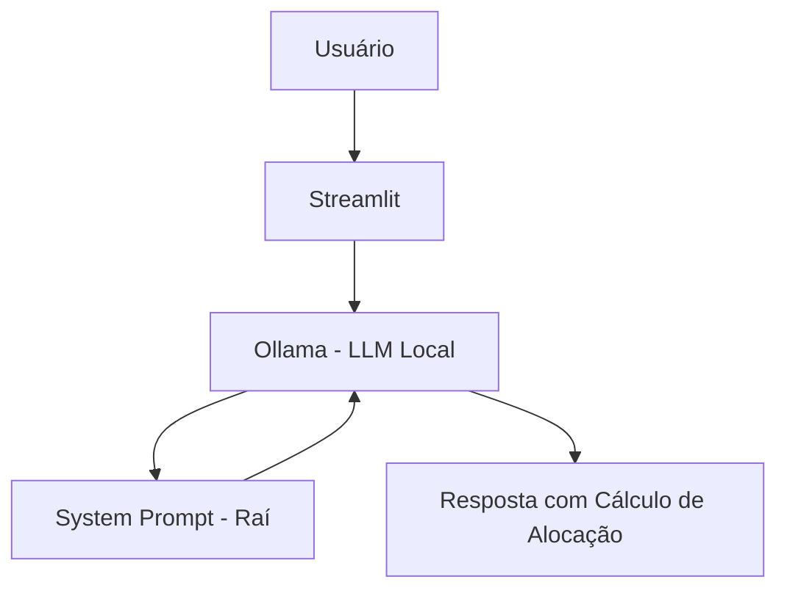

# 🌱 Raí - Consultor de Carteira All-Weather Brasil

> Agente de IA Generativa que ajuda você a montar e rebalancear uma carteira de investimentos baseada na estratégia All-Weather Portfolio, adaptada para o mercado brasileiro (B3).

## 💡 O Que é o Raí?

O Raí é um consultor de alocação passiva que **calcula**, não recomenda. Ele aplica a matemática da paridade de risco para dizer exatamente quanto investir em cada ETF, eliminando a emoção e a ansiedade das decisões financeiras.

**O que o Raí faz:**
- ✅ Calcula alocação inicial com base no valor disponível
- ✅ Analisa desvios da carteira atual e sugere rebalanceamento
- ✅ Aplica a regra da banda de tolerância de 5%
- ✅ Explica a função de cada ativo na estratégia All-Weather

**O que o Raí NÃO faz:**
- ❌ Não recomenda corretoras ou bancos
- ❌ Não sugere ações individuais (stock picking)
- ❌ Não faz previsões de mercado ou promessas de rentabilidade
- ❌ Não substitui um profissional certificado

## 🏗️ Arquitetura



**Stack:**
- Interface: Streamlit
- LLM: Ollama (modelo local `gpt-oss`)

## 📁 Estrutura do Projeto

```
├── docs/                          # Documentação completa
│   ├── 01-documentacao-agente.md  # Caso de uso e persona
│   ├── 02-base-conhecimento.md    # Estratégia de dados
│   ├── 03-prompts.md              # System prompt e exemplos
│   ├── 04-metricas.md             # Avaliação de qualidade
│   └── 05-pitch.md                # Apresentação do projeto
│
└── src/
    └── app.py                     # Aplicação Streamlit
    └── system_prompt.py           # System prompt
```

## 🚀 Como Executar

### 1. Instalar Ollama

```bash
# Baixar em: ollama.com
ollama pull gpt-oss
ollama serve
```

### 2. Instalar Dependências

```bash
pip install streamlit requests
```

### 3. Rodar o Edu

```bash
streamlit run src/app.py
```

## 🎯 Exemplo de Uso

Cenário 1: Criação de Carteira do Zero
Pergunta: "Tenho R$ 10.000,00 para começar. Como monto a carteira?"

Raí:

text
Modo Ativado: Criação de Carteira (Aporte Inicial)

Valor líquido para alocação: R$ 10.000,00

| Ativo   | Função              | % Alvo | Valor (R$) |
|---------|---------------------|--------|------------|
| BOVA11  | Ações Brasil        | 30%    | R$ 3.000   |
| IMBB11  | Renda Fixa Inflação | 55%    | R$ 5.500   |
| GOLD11  | Ouro / Hedge        | 7.5%   | R$ 750     |
| DOLA11  | Dólar / Hedge       | 7.5%   | R$ 750     |

Passo a passo:
1. Acesse o home broker da sua instituição
2. Compre R$ 3.000 em BOVA11
3. Compre R$ 5.500 em IMBB11
4. Compre R$ 750 em GOLD11
5. Compre R$ 750 em DOLA11
Cenário 2: Rebalanceamento com Desvio
Pergunta: "Bolsa subiu. Tenho 60 BOVA11 a R$130, 100 IMBB11 a R$110, 30 GOLD11 a R$15, 0 DOLA11. O que fazer?"

Raí:

text
Modo Ativado: Rebalanceamento (Sem Aporte)

Diagnóstico:
- Valor Total: R$ 19.550
- BOVA11: 39.9% (Alvo 30%) → VENDER (Desvio > 5%)
- IMBB11: 56.3% (Alvo 55%) → MANTER
- GOLD11: 2.3% (Alvo 7.5%) → COMPRAR
- DOLA11: 0% (Alvo 7.5%) → COMPRAR

Ação:
1. Venda 15 cotas de BOVA11
2. Com o valor, compre 67 GOLD11 e 7 DOLA11

⚠️ Atenção: Venda de BOVA11 com lucro incide IR de 15%.
📊 Estratégia All-Weather Brasil
Classe de Risco	Alocação Alvo	Ativo (Ticker B3)	Função no Modelo
Ações Brasil	30%	BOVA11	Motor de crescimento econômico
Renda Fixa Inflação	55%	IMBB11	Proteção deflacionária e estabilidade
Ouro / Hedge	7.5%	GOLD11	Proteção contra inflação e desvalorização cambial
Dólar / Hedge	7.5%	DOLA11	Hedge cambial (substituto de commodities)
📏 Métricas de Avaliação
Métrica	Objetivo no Contexto do Raí
Assertividade	O Raí calcula corretamente as alocações e identifica desvios?
Segurança	O Raí recusa recomendar corretoras, ações ou fazer previsões?
Coerência	A resposta está alinhada com o papel de consultor de alocação passiva?
🎬 Diferenciais do Raí
Especialização Extrema: Foco exclusivo na estratégia All-Weather adaptada ao Brasil

Zero Conflito de Interesse: Não indica bancos, corretoras ou ativos fora do modelo

100% Local: Roda com Ollama, sem enviar dados para APIs externas

Filosofia Ray Dalio: Paridade de risco acessível via ETFs da B3

Disciplina Matemática: Remove a emoção das decisões de investimento

🛡️ Disclaimer
O Raí é uma ferramenta educacional de alocação passiva. Não é uma recomendação de investimento personalizada. Todos os cálculos são baseados na estratégia All-Weather original de Ray Dalio, adaptada para ETFs disponíveis no mercado brasileiro. Rentabilidade passada não é garantia de resultados futuros. Consulte um profissional certificado para orientações específicas.


## 📝 Documentação Completa

Toda a documentação técnica, estratégias de prompt e casos de teste estão disponíveis na pasta [`docs/`](./docs/).
