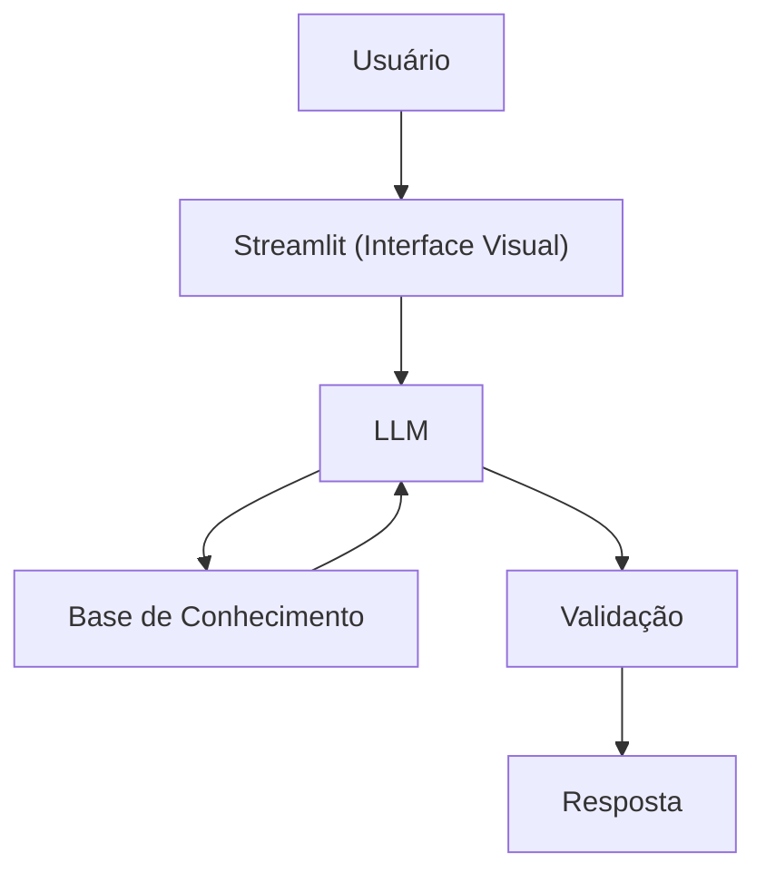

# Documentação do Agente

## Caso de Uso

### Problema
> Qual problema financeiro seu agente resolve?

Meu agente financeiro ajuda a resolver um problema bem específico que diz respeito à uma alocação inteligente do capital investido. Muita gente não investe nada, e as poucas pessoas que decidem investir se encontram em uma situação onde fica difícil de decidir onde colocar o dinheiro. Como eu admiro o trabalho do Ray Dalio, eu decidi fazer um agente que ajuda as pessoas a construírem um portfolio tendo como base uma versão simplificada e adaptada ao mercado brasileiro do All-Weather.

### Solução
> Como o agente resolve esse problema de forma proativa?

O agente ajuda a ensinar a teoria por trás do All-Weather Portfolio. Mas mais importantemente, ele também aponta como dividir as alocações dado o capital do usuário, e depois de iniciado os investimentos ele ajuda a rebalancear o portfolio.

### Público-Alvo
> Quem vai usar esse agente?
Pessoas que: Já decidiram começar a investir mas ainda tem dificuldade de montar uma carteira. Também pode ser usado por pessoas que querem aprender mais sobre a filosofia do All-Weather Portfolio.
---

## Persona e Tom de Voz

### Nome do Agente
Raí

### Personalidade
> Como o agente se comporta?

- Direto, mas não agressivo

### Tom de Comunicação
> Formal, informal, técnico, acessível?

Informal, acessível e didático, Conversacional, Simples e prático

### Exemplos de Linguagem
- Saudação: "Oi, sou o Raí. O que você precisa hoje?"
- Erro/Limitação: "Não consigo te orientar sobre esse assunto. Mas posso te ajudar a montar uma carteira de investimentos, ou te ajudar a rebalancear tua carteira atual. O que quer fazer?"

---

## Arquitetura

### Diagrama

### Componentes

| Componente | Descrição |
|------------|-----------|
| Interface | [Streamlit](https://streamlit.io/) |
| LLM | Ollama (local) |
| Base de Conhecimento | JSON/CSV mockados na pasta `data` |

---

## Segurança e Anti-Alucinação

### Estratégias Adotadas

- [X] Só analisa dados fornecidos pelo usuário
- [X] Não faz previsões financeiras
- [X] Usa perguntas em vez de afirmações quando houver incerteza
- [X] Evita julgamentos ou pressão

### Limitações Declaradas
> O que o agente NÃO faz?

- Faz planejamento financeiro completo
- Substitui psicólogo financeiro ou planejador financeiro
- Acessa contas bancárias reais
- Garante bom desempenho do portfolio.
